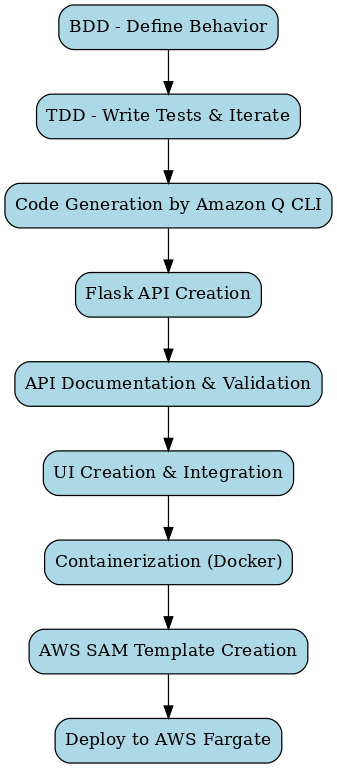
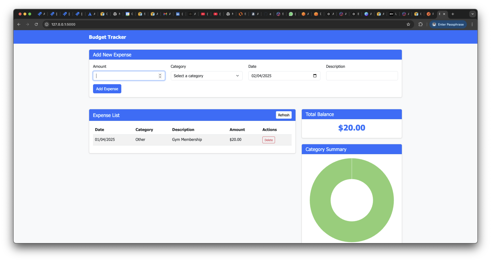

# Simple Budget Tracker

A comprehensive expense tracking application with a Flask REST API backend and a responsive HTML/CSS/JavaScript frontend.



## Table of Contents

- [Features](#features)
- [Project Structure](#project-structure)
- [Development Workflow](#development-workflow)
- [Installation](#installation)
- [Running Locally](#running-locally)
- [API Documentation](#api-documentation)
- [Docker Deployment](#docker-deployment)
- [Testing](#testing)
- [Future Enhancements](#future-enhancements)

## Features

- **Expense Tracking**: Add, update, and delete expenses with amount, category, date, and description
- **Category Management**: Organize expenses by categories
- **Summary Reports**: View expense summaries by category with visual charts
- **Balance Tracking**: Monitor your total expenses
- **Date Filtering**: Filter expenses, balances, and summaries by date range
- **Responsive UI**: User-friendly interface that works on desktop and mobile devices
- **RESTful API**: Well-structured API for programmatic access
- **Docker Support**: Containerized deployment for consistency across environments



## Project Structure

```
simple-budget-tracker/
├── src/
│   ├── app.py                 # Flask application with API endpoints
│   ├── budget_tracker.py      # Core budget tracking functionality
│   ├── static/
│   │   ├── css/
│   │   │   └── style.css      # Custom CSS styles
│   │   └── js/
│   │       └── app.js         # Frontend JavaScript
│   └── templates/
│       ├── layout.html        # Base HTML template
│       └── index.html         # Main application page
├── testing_api/
│   └── postmancollection.json # Postman collection for API testing
├── prompts/
│   ├── greencode_app_flask.md # Documentation for Flask API implementation
│   ├── flask_ui_html.md       # Documentation for HTML UI implementation
│   ├── postman.md             # Documentation for Postman collection
│   └── docker_local.md        # Documentation for Docker implementation
├── img/
│   ├── workflow_diagram.png   # Application workflow diagram
│   └── response_ui.png        # UI screenshot
├── Dockerfile                 # Docker configuration
├── .dockerignore              # Files to exclude from Docker build
├── requirements.txt           # Python dependencies
└── README.md                  # This file
```

## Development Workflow

Our development process followed these steps:

1. **Core Functionality**: Implemented the `BudgetTracker` class with expense management features
2. **REST API Development**: Created a Flask API with endpoints for expense operations
3. **API Testing**: Developed and tested API endpoints using Postman
4. **Frontend Development**: Built a responsive HTML/CSS/JS interface
5. **Containerization**: Dockerized the application for consistent deployment
6. **Documentation**: Created comprehensive documentation for all components

### Development Steps and Documentation

The following table outlines each development step and links to the corresponding documentation:

| Development Step | Description | Documentation |
|-----------------|-------------|---------------|
| Requirements Analysis | Behavior-Driven Development approach | [BDD.md](prompts/BDD.md) |
| Test-Driven Development | Testing strategy and implementation | [TDD.md](prompts/TDD.md) |
| Core Implementation | Budget tracker core functionality | [greencode.md](prompts/greencode.md) |
| REST API Development | Flask API implementation | [greencode_app_flask.md](prompts/greencode_app_flask.md) |
| Frontend Development | HTML/CSS/JS interface | [flask_ui_html.md](prompts/flask_ui_html.md) |
| Containerization | Docker implementation | [docker_local.md](prompts/docker_local.md) |
| API Testing | Postman collection for testing | To be updated |

## Installation

### Prerequisites

- Python 3.8+
- Docker (optional, for containerized deployment)

### Setup

1. Clone the repository:
   ```bash
   git clone https://github.com/yourusername/simple-budget-tracker.git
   cd simple-budget-tracker
   ```

2. Create a virtual environment and activate it:
   ```bash
   python -m venv venv
   source venv/bin/activate  # On Windows: venv\Scripts\activate
   ```

3. Install dependencies:
   ```bash
   pip install -r requirements.txt
   ```

## Running Locally

### Running the Flask Application

```bash
cd simple-budget-tracker
python src/app.py
```

The application will be available at http://localhost:5000

### Running with Docker

1. Build the Docker image:
   ```bash
   docker build -t budget-tracker .
   ```

2. Run the container:
   ```bash
   docker run -p 5000:5000 budget-tracker
   ```

The application will be available at http://localhost:5000

## API Documentation

### Endpoints

| Endpoint | Method | Description |
|----------|--------|-------------|
| `/expense` | POST | Add a new expense |
| `/expense` | GET | Get all expenses (with optional filtering) |
| `/expense/<expense_id>` | PUT | Update an existing expense |
| `/expense/<expense_id>` | DELETE | Delete an expense |
| `/balance` | GET | Get the total balance (with optional filtering) |
| `/summary` | GET | Get expense summary by category (with optional filtering) |

### Example Requests

#### Add an Expense

```bash
curl -X POST http://localhost:5000/expense \
  -H "Content-Type: application/json" \
  -d '{
    "amount": "45.99",
    "category": "Groceries",
    "date": "2025-04-02",
    "description": "Weekly grocery shopping"
  }'
```

#### Get Balance

```bash
curl -X GET http://localhost:5000/balance
```

#### Get Summary

```bash
curl -X GET http://localhost:5000/summary
```

For more detailed API documentation, refer to the Postman collection in `testing_api/postmancollection.json`.

## Docker Deployment

The application is containerized using Docker for consistent deployment across environments.

### Dockerfile Features

- Based on Python 3.11 slim image
- Optimized for size and performance
- Uses Gunicorn as the WSGI server for production
- Properly handles Python module imports

### Building and Running

```bash
# Build the image
docker build -t budget-tracker .

# Run the container
docker run -p 5000:5000 budget-tracker
```

## Testing

### API Testing with Postman

A comprehensive Postman collection is provided in `testing_api/postmancollection.json` for testing all API endpoints.

To use the collection:
1. Import the collection into Postman
2. Set the `baseUrl` variable to your API's base URL (default is http://localhost:5000)
3. Run the requests to test the API functionality

## Future Enhancements

- **User Authentication**: Add user accounts and authentication
- **Data Persistence**: Implement database storage (PostgreSQL, MongoDB)
- **Budget Setting**: Allow users to set budget limits by category
- **Recurring Expenses**: Support for recurring expense entries
- **Data Export**: Export expense data to CSV/PDF
- **Mobile App**: Develop native mobile applications
- **Cloud Deployment**: Deploy to AWS using Fargate and other managed services

---

## Contributing

Contributions are welcome! Please feel free to submit a Pull Request.

## License

This project is licensed under the MIT License - see the LICENSE file for details.
