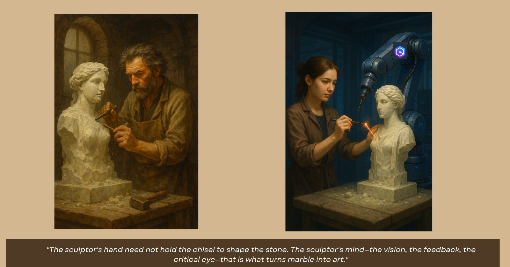

# The Sculptor and the Robotic Arm: A Story of Amazon Q

## The Traditional Sculptor's Journey

Imagine a master sculptor named Maya. For decades, Maya has created beautiful statues using nothing but her hands, a hammer, and a chisel. Each masterpiece takes months of painstaking work:

1. First, she selects the perfect block of marble
2. Then, she sketches rough outlines on the stone
3. Next comes the grueling process of removing large chunks of unwanted material
4. After that, she spends weeks refining the general shape
5. Finally, she dedicates months to the delicate details that bring the statue to life

Each tap of the chisel is deliberate. Each day brings incremental progress. The process is slow, methodical, and requires immense skill developed over years of practice. This is traditional software development—writing code line by line, function by function, debugging as you go.

## Enter the Robotic Arm

One day, Maya is introduced to an advanced robotic arm—a machine that can carve with precision using laser technology. This is Amazon Q Developer.

The robotic arm can cut through marble in minutes instead of days. It can replicate patterns with perfect accuracy. It can work tirelessly without breaks.

But there's a catch: the robotic arm doesn't know what to create. It has no artistic vision. It needs guidance.

## The First Attempt: The One-Liner Instruction

Excited by the possibilities, Maya gives the robotic arm a simple instruction:

> "Create a beautiful statue of a person."

The arm whirs into action, lasers blazing. In just an hour, it produces... something. It's humanoid, yes, but lacks proportion. The features are generic. There's no emotion, no story, no soul.

Maya realizes her mistake. The robotic arm executed exactly what she asked for—but her instruction was too vague, too broad. This is like asking Amazon Q to "build me a budget tracking app" and expecting a perfect, complete solution from a single prompt.

## The Iterative Approach: A Dance of Human and Machine

Maya changes her strategy. Instead of a single instruction, she decides to work *with* the robotic arm in stages:

1. **Foundation First**: "Create a rough human form, 6 feet tall, standing in contrapposto pose."
   * The arm creates a basic form
   * Maya examines it, identifies issues with weight distribution

2. **Refine the Structure**: "Adjust the weight distribution so 70% rests on the right leg."
   * The arm makes precise adjustments
   * Maya approves the stance but notices the proportions need work

3. **Iterative Detailing**: "Refine the facial features to show contemplation, with slightly furrowed brows."
   * The arm carves delicate expressions
   * Maya provides feedback on emotional impact

4. **Targeted Corrections**: "The left hand looks stiff. Make it more relaxed, with fingers gently curled."
   * The arm makes the specific correction
   * Maya evaluates and requests further refinements

This back-and-forth continues, with Maya providing increasingly specific guidance based on what she sees taking shape. The robotic arm executes each instruction with precision, but Maya's artistic vision drives the process.

## The Budget Tracker Project: A Similar Dance

This is exactly how we built the Budget Tracker application with Amazon Q:

1. **Foundation First**: We didn't ask for a complete application in one go. We started with the core functionality:
   * "Create a BudgetTracker class with expense management features"
   * Amazon Q delivered the foundation, which we evaluated and refined

2. **Building Components Methodically**:
   * "Create a Flask REST API using the BudgetTracker class with specific endpoints"
   * "Create a Postman Collection to validate all use cases"
   * "Create an HTML interface for the Budget Tracker application"
   * Each component was built upon the previous one, with feedback and adjustments

3. **Deployment and Infrastructure**:
   * "Write a Dockerfile to containerize this Flask application"
   * When issues arose (like the module import error), we provided specific feedback

4. **Documentation and Refinement**:
   * "Create a detailed README for end-to-end workflow"
   * "Add a table referencing the workflow and related prompts"

At each stage, we evaluated Amazon Q's output, provided feedback, made adjustments, and moved forward. The process was interactive and iterative—a true collaboration between human vision and AI capability.

## The Masterpiece: A Product of Collaboration

After weeks of this iterative process, Maya and the robotic arm complete a statue that is truly magnificent. It has the technical perfection that the robotic arm can achieve, guided by the artistic vision and feedback that only Maya could provide.

Similarly, our Budget Tracker application combines:
- The technical implementation that Amazon Q can generate quickly
- The architectural decisions, feedback, and vision that we provided
- The iterative refinement that comes from the back-and-forth process

## The Lesson: Prompt Engineering as Artistic Direction

The key insight is that working with Amazon Q is not about writing a perfect one-line prompt that magically produces a complete solution. It's about:

1. **Breaking down the problem** into logical components
2. **Starting with foundations** and building up
3. **Providing specific feedback** at each stage
4. **Iterating based on results** rather than expecting perfection immediately
5. **Maintaining a clear vision** of the end goal while being flexible about the path

Just as Maya wouldn't hand her chisel to an apprentice and say "make a beautiful statue," we shouldn't expect Amazon Q to understand our complete vision from a vague prompt. The magic happens in the conversation—the back-and-forth that combines human creativity with AI capability.

## Conclusion: The New Artisans

Maya doesn't see the robotic arm as a replacement for her skills. She sees it as a revolutionary tool that, when guided by her expertise, allows her to create more ambitious works in less time.

Similarly, Amazon Q doesn't replace developers—it amplifies them. It handles the repetitive chiseling while we focus on the artistic direction. We are the new artisans, wielding AI tools with the same creative vision and critical judgment that has always distinguished great creators.

The Budget Tracker application stands as testimony to this new way of working—not a product of either human or AI alone, but a true collaboration that leverages the strengths of both.

---

*"The sculptor's hand need not hold the chisel to shape the stone. The sculptor's mind—the vision, the feedback, the critical eye—that is what turns marble into art."*
